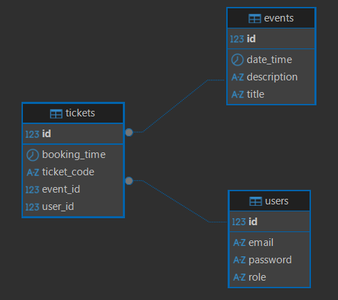
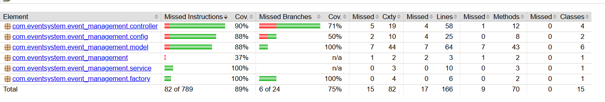
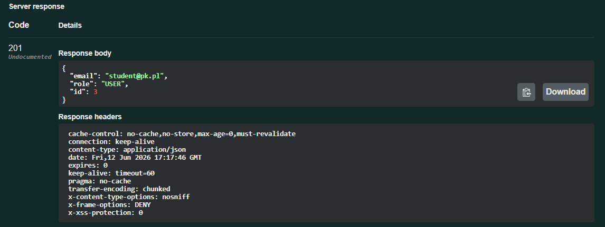
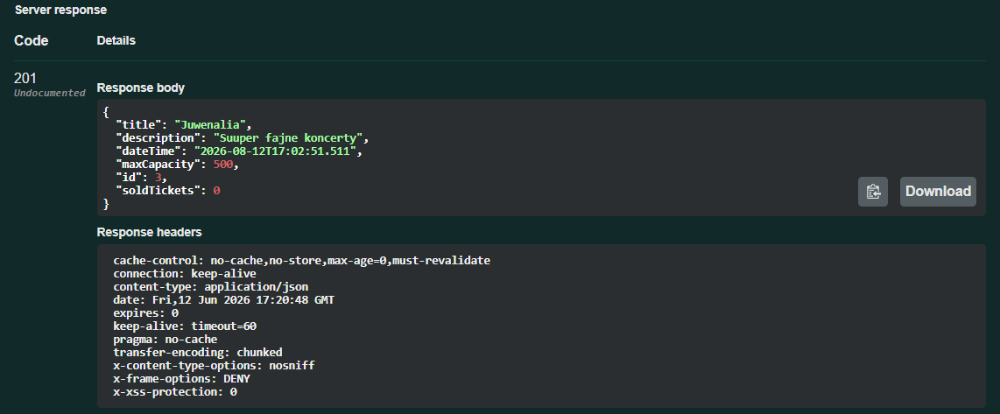
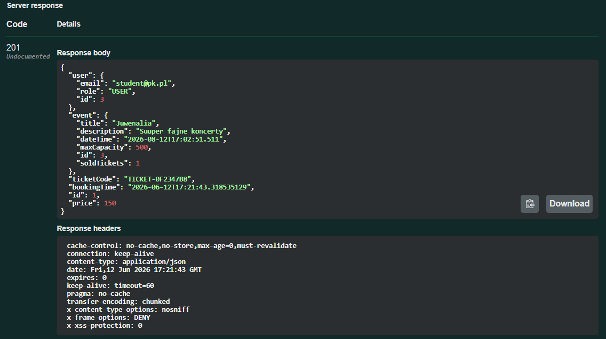
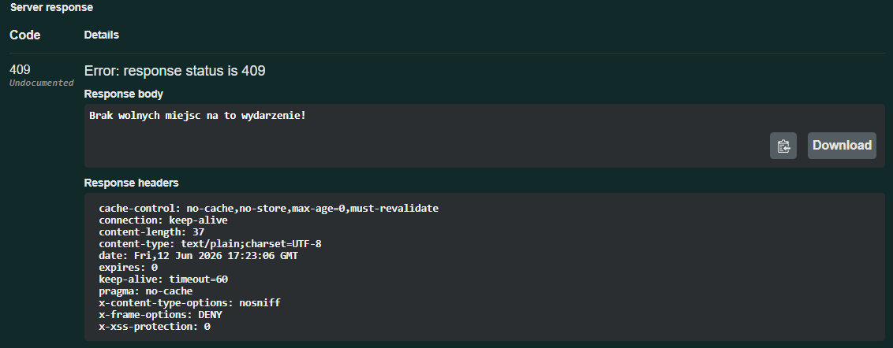
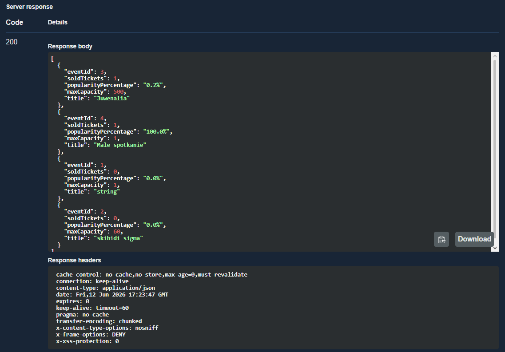

# 🎫 System Zarządzania Wydarzeniami (Event Management System)

Projekt zaliczeniowy zrealizowany w ramach laboratorium z programowania obiektowego. Aplikacja to kompletne, bezstanowe REST API służące do zarządzania wydarzeniami kulturalnymi, naukowymi i rozrywkowymi, a także do obsługi procesu rezerwacji biletów. 

Projekt został zaprojektowany z rygorystycznym zachowaniem **filarów programowania obiektowego (OOP)** oraz **zasad SOLID**, opierając się na nowoczesnej architekturze wielowarstwowej (MVC / N-Tier).

---

## 📑 Spis Treści
1. [Wykorzystane Technologie](#-wykorzystane-technologie)
2. [Architektura i Zasady SOLID](#-architektura-i-zasady-solid)
3. [Wzorce Projektowe i Paradygmat Obiektowy](#-wzorce-projektowe-i-paradygmat-obiektowy)
4. [Bezpieczeństwo i Logika Biznesowa (RBAC)](#-bezpieczeństwo-i-logika-biznesowa-rbac)
5. [Przegląd API (Endpointy)](#-przegląd-api-endpointy)
6. [Uruchomienie Projektu](#-uruchomienie-projektu)
7. [Dokumentacja Wizualna (Zrzuty ekranu)](#-dokumentacja-wizualna-dowody-działania)

---

## 🛠️ Wykorzystane Technologie

Stos technologiczny został dobrany tak, aby symulować komercyjne środowisko produkcyjne:

* **Język i Środowisko:** Java 17
* **Główny Framework:** Spring Boot 3 (Web, Data JPA, Security)
* **Zarządzanie Zależnościami:** Maven (wykorzystanie pełnego cyklu życia i wtyczek m.in. do raportowania)
* **Baza Danych (Produkcja):** PostgreSQL (relacyjna baza danych zapewniająca spójność i transakcyjność)
* **Migracje Bazy Danych:** Flyway (wersjonowanie i automatyczna egzekucja skryptów SQL)
* **Dokumentacja API:** Swagger UI / Springdoc OpenAPI
* **Infrastruktura / DevOps:** Docker & Docker Compose (pełna konteneryzacja bazy i aplikacji)
* **Testowanie i Jakość:** JUnit 5, Mockito, JaCoCo (raportowanie pokrycia kodu)

---

## 🏛️ Architektura i Zasady SOLID

Kod został napisany z absolutnym odrzuceniem antywzorców programowania strukturalnego. Zastosowano podejście wielowarstwowe (Controller -> Service -> Repository) i zaimplementowano poniższe reguły SOLID:

* **[S] Single Responsibility Principle (SRP):** Klasy mają tylko jedną odpowiedzialność. `EventController` zajmuje się wyłącznie mapowaniem HTTP i routingiem, logika rezerwacji spoczywa w warstwie usług, a walidacja danych odbywa się na poziomie definicji modelu.
* **[O] Open/Closed Principle (OCP):** Aplikacja jest otwarta na rozbudowę. Dzięki zastosowaniu interfejsów i klas abstrakcyjnych, dodanie np. nowego typu biletu ze zniżką studencką wymaga jedynie dopisania nowej klasy rozszerzającej bazowy obiekt biletu, bez modyfikacji istniejącego kodu.
* **[L] Liskov Substitution Principle (LSP):** W całym systemie wykorzystywana jest abstrakcja nadrzędna. System bezbłędnie procesuje obiekty podrzędne (`VipTicket`, `StandardTicket`), a polimorficzne wywołanie metod gwarantuje oczekiwane zachowanie bez konieczności rzutowania typów.
* **[I] Interface Segregation Principle (ISP):** Interfejsy są małe i wyspecjalizowane. Wykorzystano wbudowane `JpaRepository`, oddzielając operacje dla użytkowników, wydarzeń i biletów.
* **[D] Dependency Inversion Principle (DIP):** Wszystkie zależności są wstrzykiwane przez konstruktory (Dependency Injection), odwracając sterowanie i ułatwiając testowanie aplikacji za pomocą Mockito.

---

## 🧩 Wzorce Projektowe i Paradygmat Obiektowy

Aby spełnić wymóg zaawansowanego programowania obiektowego, zrealizowano wszystkie cztery filary OOP:

1. **Abstrakcja i Dziedziczenie:** Stworzono klasę bazową dla biletów, z której dziedziczą specjalistyczne implementacje. Współdzielą one podstawowe atrybuty (jak powiązany użytkownik czy wydarzenie), ale ukrywają detale swojej implementacji.
2. **Polimorfizm:** Metoda odpowiedzialna za wycenę biletu została przeciążona. Wywołanie jej na liście różnych biletów dynamicznie przypisze odpowiednią wartość (np. 150.0 dla VIP, 50.0 dla Standard).
3. **Hermetyzacja:** Zmienne instancyjne są prywatne. Dostęp do nich odbywa się przez kontrolowane metody (gettery/settery), co zapobiega ustawieniu nieprawidłowego stanu (np. ujemnej pojemności wydarzenia).
4. **Wzorzec Projektowy (Factory Method):** Cały proces tworzenia obiektów scentralizowano w klasie `TicketFactory`. Warstwa kliencka (kontroler) nie wie, jak stworzyć bilet – deleguje to do Fabryki, która na podstawie podanego typu zwraca gotowy, spersonalizowany obiekt.

---

## 🛡️ Bezpieczeństwo i Logika Biznesowa (RBAC)

Aplikacja wykorzystuje Spring Security z konfiguracją uwierzytelniania HTTP Basic, co jest zgodne z dobrymi praktykami budowania REST API. Hasła użytkowników nie są przechowywane otwartym tekstem – chroni je algorytm **BCrypt**.

### Autoryzacja i Role
* **Rola USER (Użytkownik):**
  * Zyskuje dostęp do API po rejestracji.
  * Może przeglądać dostępne wydarzenia i tworzyć nowe.
  * Posiada prawo do rezerwacji biletów na wydarzenia.
* **Rola ADMIN (Administrator):**
  * Oprócz uprawnień użytkownika, posiada dostęp do całego rejestru biletów.
  * Wyłącznie administrator może wygenerować dedykowany raport analityczny (`popularity report`).

### Reguły Biznesowe (Anti-Overbooking)
System chroni spójność danych. Rezerwacja biletu uruchamia transakcję bazodanową, która sprawdza aktualne zapełnienie wydarzenia w stosunku do jego limitu. Wyprzedanie miejsc skutkuje natychmiastowym przerwaniem operacji i zwróceniem kodu błędu **409 Conflict**.

---

## 🌐 Przegląd API (Endpointy)

Wybrane, kluczowe ścieżki udostępnione w systemie:

| Metoda | Endpoint | Opis | Wymagana Rola |
|---|---|---|---|
| POST | `/api/users/register` | Rejestracja nowego użytkownika w systemie | Brak (Publiczne) |
| POST | `/api/events` | Tworzenie nowego wydarzenia | USER / ADMIN |
| POST | `/api/tickets/book` | Rezerwacja miejsca i wygenerowanie biletu | USER / ADMIN |
| GET | `/api/reports/popularity` | Raport % popularności posortowany malejąco | ADMIN |

---

## 🚀 Uruchomienie Projektu

Aplikacja jest w 100% skonteneryzowana. Nie wymaga lokalnej instalacji bazy danych ani konfigurowania serwera. Wystarczy Docker oraz Java.

**Krok 1: Budowa paczki wykonawczej (bez uruchamiania testów)**
> `mvn clean package -DskipTests`

**Krok 2: Uruchomienie środowiska za pomocą Docker Compose**
*(Docker automatycznie pobierze obraz PostgreSQL, odpali migracje Flyway i uruchomi serwer Spring Boot).*
> `docker compose up --build -d`

Interaktywna dokumentacja **Swagger UI** (umożliwiająca wysyłanie testowych żądań) dostępna jest pod adresem: 
👉 `http://localhost:8080/swagger-ui/index.html`

---

## 📸 Dokumentacja Wizualna (Dowody Działania)

Wymagane zrzuty ekranu potwierdzające poprawne zaimplementowanie założeń projektowych.

### 1. Diagram ERD Bazy Danych
Model relacyjny wygenerowany na podstawie migracji Flyway (obrazuje tabele users, events oraz tickets i ich powiązania).

### 2. Historia Git Flow (Branching i Pull Requests)
Zastosowano systematyczne, opisowe i podpisane commity. Zmiany wdrażano zgodnie z dobrymi praktykami za pomocą mechanizmu Pull Requests (gałęzie feature).

### 3. Pokrycie Kodu Testami (Raport JaCoCo)
Zrzut ekranu raportu potwierdzający spełnienie krytycznego wymogu testowania. Kod logiki biznesowej, dzięki wykorzystaniu JUnit 5 i bazy H2 w pamięci, pokryto testami w stopniu przekraczającym wymagane 80%.

### 4. Działanie Logiki Biznesowej: Rejestracja i Rezerwacja
Dowód z narzędzia Swagger: Pomyślna autoryzacja, zapis użytkownika i rezerwacja. System użył wzorca Fabryki, przydzielił unikalny kod, wyliczył cenę (polimorfizm) i zwrócił status 201 Created.

Utworzenie nowego użytkownika.

Rejestracja nowego eventu.

Generowanie biletu.

### 5. Walidacja Overbookingu (Zabezpieczenie przed błędem)
Potwierdzenie zadziałania blokady bezpieczeństwa. Aplikacja uniemożliwiła zakup biletu po przekroczeniu limitu pojemności wydarzenia, zwracając status 409 Conflict.

Overbooking.

### 6. Funkcjonalność Analityczna: Raporty Popularności
Wywołanie endpointu zastrzeżonego wyłącznie dla roli ADMIN. Zwraca on uporządkowaną listę wydarzeń z matematycznie wyliczonym współczynnikiem sprzedanych miejsc.

Generowanie raportu.

Autorzy projektu: Filip Hanek, Dawid Kamiński